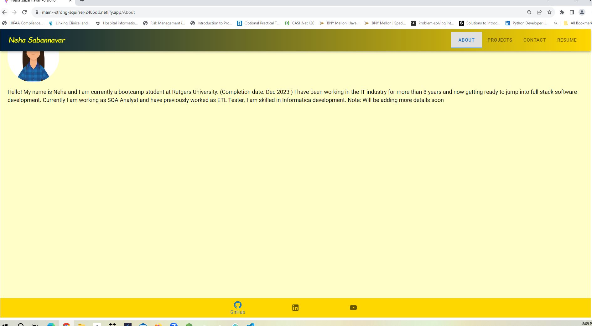
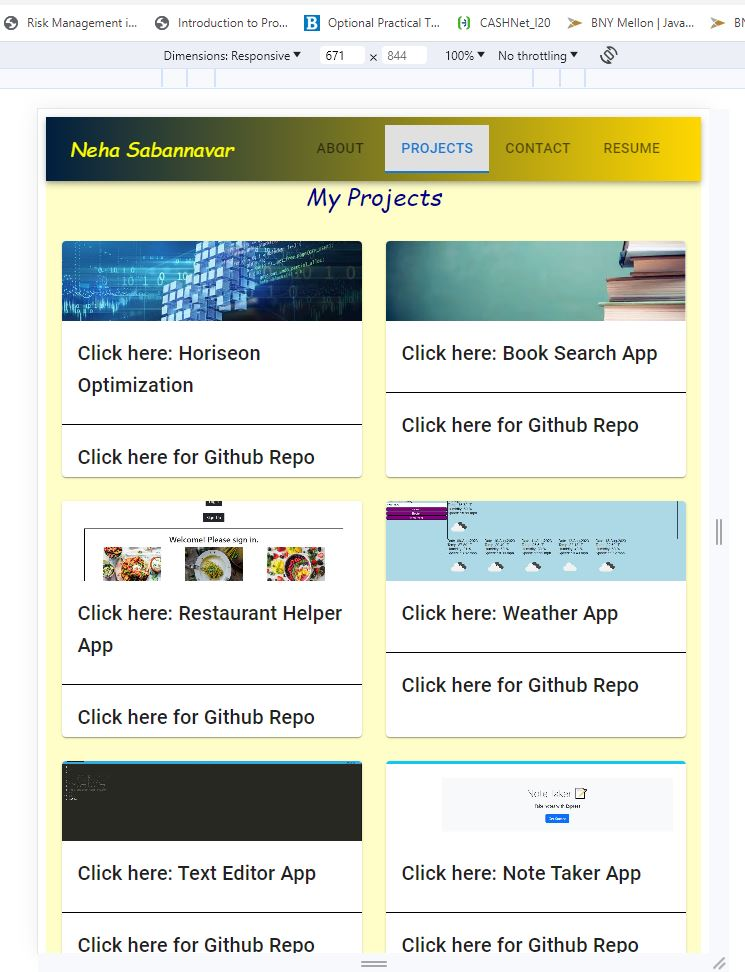
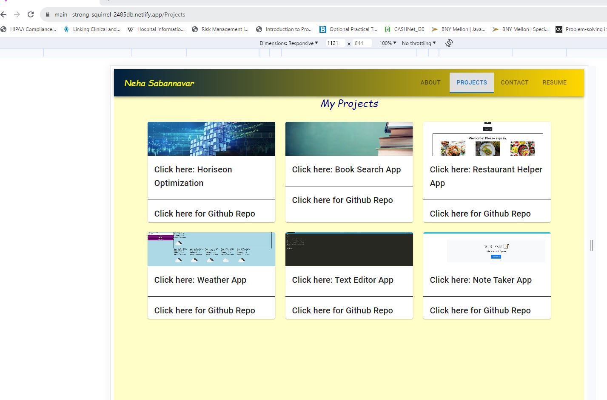

# Portfolio 
  ## Description
  This Portfolio is built by using React and Material UI. It consolidates my latest projects, resume and details about me. It also has a form, if someone wants to get in touch with me.  Footer includes link to my gibthub profile, linkdin profile and youtube link to my channel. As it is using materail UI, it is mobile fisrt app, with responsive design. 

  ## Link:
  https://strong-squirrel-2485db.netlify.app/

  It looks like below image:

  ## Table of Content

  - [Installation](#installation)
  - [Usage](#usage)
  - [Contribution Details](#contribution-details)
  - [Test Instructions](#test-instructions) 
  - [License](#licenses)
  - [Contact](#contact)
  
  

  ## Installation: 
  browser to open the link
  ## Usage:
  use to get developer'stechnical details
  ## Contribution Details: 
  Neha Sabannavar, Rutgers TA, AskBCS, https://mui.com/material-ui/, https://vitejs.dev/guide/static-deploy.html#netlify-with-git, https://reactrouter.com/en/main
  ## Test Instructions: 
  none

  ## Licenses: 
  MIT
      
  https://opensource.org/licenses/MIT 

  
  ## Contact: 
  Below mentioned is my github profile link 

  ## Github: https://github.com/nehaps29
 
